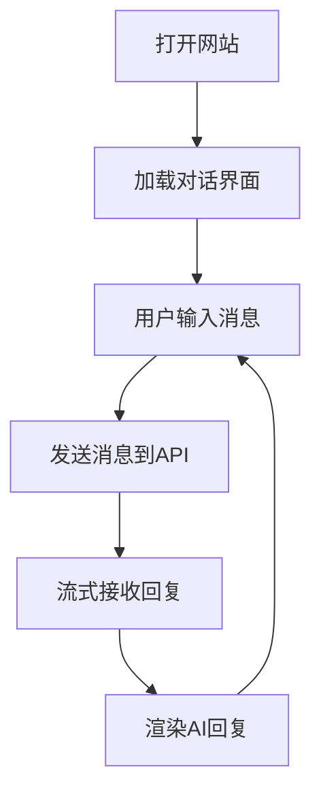

## 1. 产品概述

一个极简优雅的AI对话网站，用户可以通过简洁的界面与AI进行多轮对话。采用深色主题设计，强调内容的可读性和对话的沉浸感。

## 2. 核心功能

### 2.1 功能模块
1. **对话页面**: 聊天界面、消息历史、输入框
2. **设置面板**: API配置（隐藏模型名称）、对话参数调整

### 2.2 页面详情
| 页面名称 | 模块名称 | 功能描述 |
|---------|---------|---------|
| 对话页 | 聊天区域 | 显示用户和AI的消息气泡，支持Markdown渲染 |
| 对话页 | 输入框 | 多行文本输入，支持Enter发送、Shift+Enter换行 |
| 对话页 | 侧边栏 | 对话历史列表，可新建对话 |
| 设置页 | API配置 | 用户可配置自己的API密钥（默认已填充） |
| 设置页 | 参数调整 | 温度、最大token数等参数设置 |

## 3. 核心流程

用户打开网站 → 进入对话界面 → 在输入框输入问题 → 点击发送或按Enter → 显示AI流式回复 → 可继续对话或新建对话

## 4. 用户界面设计

### 4.1 设计风格
- **主题**: 深色模式，深邃优雅的暗色调
- **主色**: #0f0f0f（背景）、#1a1a1a（卡片）
- **强调色**: #e8e4d9（暖白色文字）、#4a9eff（蓝色强调）
- **字体**: 标题使用 "Noto Serif SC"，正文使用 "Noto Sans SC"
- **布局**: 左侧边栏 + 右侧主聊天区
- **圆角**: 12px 统一圆角
- **动效**: 消息出现时的淡入动画，打字指示器脉冲效果

### 4.2 页面设计概述
| 页面名称 | 模块名称 | UI元素 |
|---------|---------|--------|
| 对话页 | 侧边栏 | 深色背景，对话历史列表，新建对话按钮 |
| 对话页 | 聊天区 | 消息气泡（用户右对齐蓝色，AI左对齐灰色），Markdown渲染 |
| 对话页 | 输入区 | 底部固定，多行输入框，发送按钮 |
| 设置页 | 配置面板 | 表单输入，滑动条，开关按钮 |

### 4.3 响应式设计
- 桌面端：左侧260px侧边栏 + 右侧自适应聊天区
- 移动端：侧边栏可收起，全屏聊天区

### 4.4 视觉细节
- 背景使用微妙的噪点纹理增加质感
- 消息气泡带有柔和阴影
- 代码块使用深色高亮主题
- 输入框聚焦时有蓝色光晕效果
