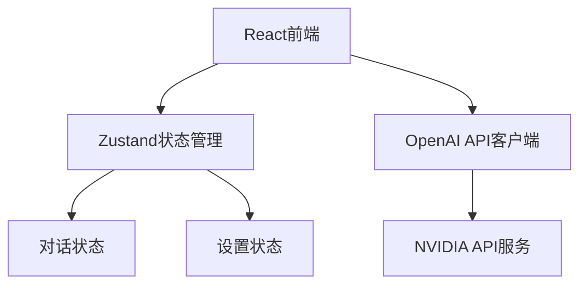

## 1. 架构设计



## 2. 技术描述
- **前端**: React@18 + TypeScript + TailwindCSS + Vite
- **状态管理**: Zustand
- **HTTP客户端**: 原生fetch（支持流式响应）
- **Markdown渲染**: react-markdown + remark-gfm
- **代码高亮**: prismjs
- **图标**: lucide-react

## 3. 路由定义
| 路由 | 用途 |
|-----|------|
| / | 主对话页面 |
| /settings | 设置页面 |

## 4. API定义

### 4.1 请求类型
```typescript
interface ChatRequest {
  model: string;
  messages: Array<{
    role: 'user' | 'assistant' | 'system';
    content: string;
  }>;
  temperature: number;
  max_tokens: number;
  stream: boolean;
}
```

### 4.2 响应类型
```typescript
interface ChatResponse {
  id: string;
  choices: Array<{
    delta: {
      content?: string;
    };
    finish_reason: string | null;
  }>;
}
```

## 5. 数据模型

### 5.1 对话数据
```typescript
interface Conversation {
  id: string;
  title: string;
  messages: Message[];
  createdAt: number;
  updatedAt: number;
}

interface Message {
  id: string;
  role: 'user' | 'assistant';
  content: string;
  timestamp: number;
}
```

### 5.2 设置数据
```typescript
interface Settings {
  apiKey: string;
  apiUrl: string;
  temperature: number;
  maxTokens: number;
}
```

## 6. 安全考虑
- API密钥存储在localStorage中（前端加密）
- 模型名称在代码中硬编码，不向用户暴露
- 所有API请求通过前端直接发送
